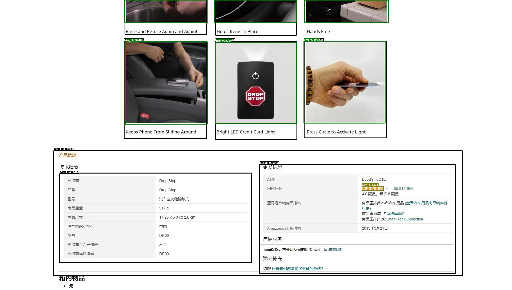
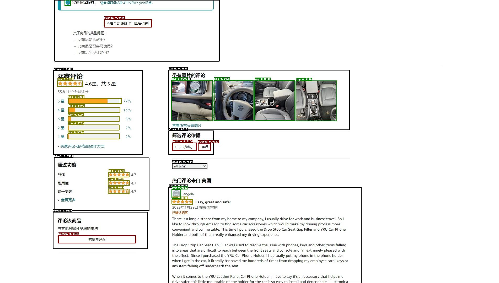
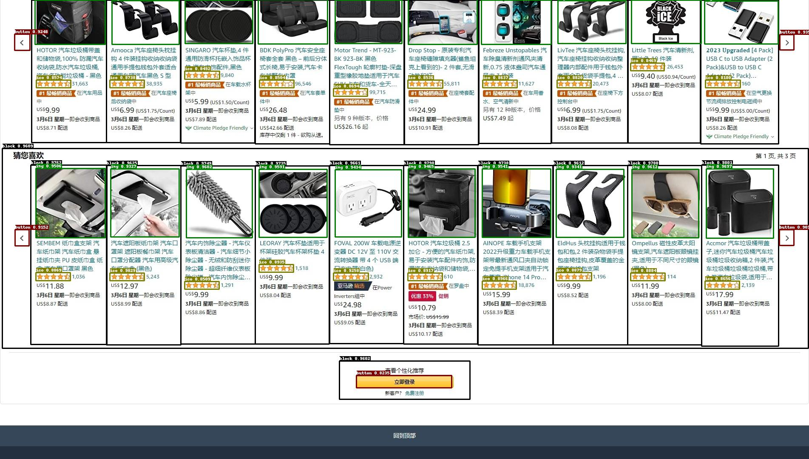
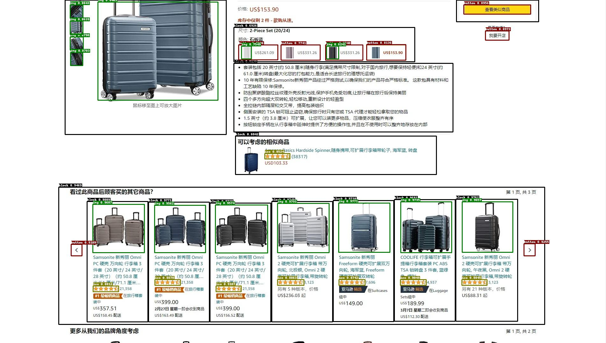

# zxUIED
网页元素检测算法。

## 第一期

亚马逊前台后台页面元素解析。

### 1、目标效果

在打区块中检测出指定的元素（按钮，下拉框，图片，图标，输入框等）

### 2、算法思路

由于需要检测出外面的block区域，还要检测出指定的元素，而嵌套的框对于检测来说可能会有一定的难度，因此，考虑分成2个算法：

- block检测模型（ppyoloe_plus）
  - 类别：block
- 元素检测模型（ppyoloe_crn_s_p2_alpha）
  - 类别：select，button，img，ico

两个模型检测出区块（block）和元素后，根据包含关系做结构化输出（json）

### 3、数据

#### 数据采集

selenium库中的webdriver自动截取亚马逊网页长图

#### 数据标注

1. block检测
   1. 由于用网页解析的方法比较难精准的获取想要的block，大量的div需要手动调整，因此对于block检测的数据采用人工的方式做标注。
2. 元素检测
   1. 页面解析：用webdriver库通过页面的元素样式，tagname，以及xpath查找出符合条件的元素框。
   2. 手动调整解析效果不好的元素框。
   3. 裁剪出所有元素框ROI，保存下来，手动进行分类打标，可借助模板匹配的方法，先手动挑选出一些正确的ROI作为模板，去所有ROI中查找相似度较高的，经过筛选几次后就可以用于分类了。
   4. 用分好类的ROI训练一个ResNet50的分类网络，对原始的解析结果反向打标，再人工调整标错的类别，就可以作为多类别的元素目标检测数据了。

### 4、算法效果

|  |
| ------------------------- |
|  |
|  |
|   |
